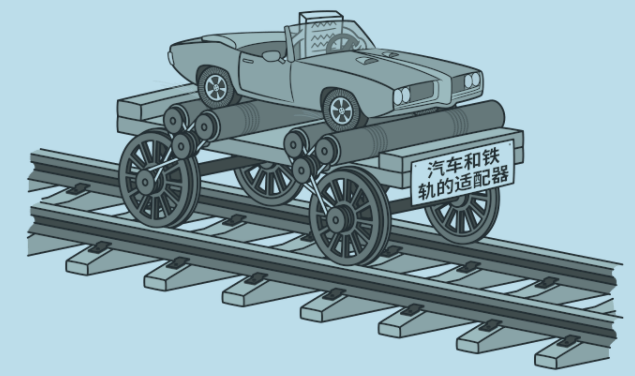
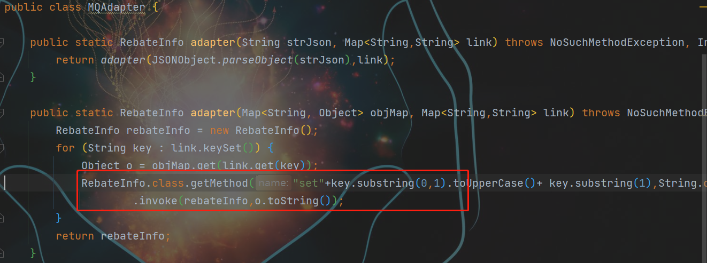
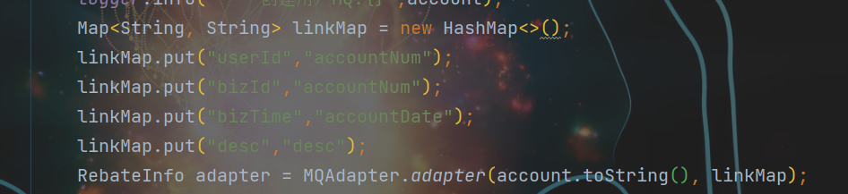

# design_mode_demo https://github.com/fuzhengwei/CodeGuide/wiki#school_satchel-%E5%AE%9E%E6%88%98%E8%AE%BE%E8%AE%A1%E6%A8%A1%E5%BC%8F

## java设置模式  
  1. **工厂方法模式-factory-design** \
      **工厂方法模式介绍** \

工厂模式又称工厂方法模式，是一种创建型设计模式.

**实现步骤：** \
&nbsp;&nbsp;&nbsp;&nbsp; * 提供一个公用接口，并提供需要实现的方法 \
&nbsp;&nbsp;&nbsp;&nbsp; * 具体的业务即子类，实现该接口

这种设计模式也是 Java 开发中最常见的一种模式，它的主要意图是定义一个创建对象的接口，让其子类自己决定实例化哪一个工厂类，工厂模式使其创建过程延迟到子类进行。

简单说就是为了提供代码结构的扩展性，屏蔽每一个功能类中的具体实现逻辑。让外部可以更加简单的只是知道调用即可，同时，这也是去掉众多 ifelse 的方式。当然这可能也有一些缺点，比如需要实现的类非常多，如何去维护，怎样减低开发成本。但这些问题都可以在后续的设计模式结合使用中，逐步降低。
* * *
2. **工厂抽象模式-abstractfactory** \
      **工厂抽象模式介绍** 
      

工厂抽象模式，是一种创建型设计模式,需要**提供一个中心工厂来实现其他工厂**

**实现步骤：** \
&nbsp;&nbsp;&nbsp;&nbsp; * 提供一个公用适配接口，并提供需要实现的方法 \
&nbsp;&nbsp;&nbsp;&nbsp; * 具体的业务即子类，实现该适配接口 \
&nbsp;&nbsp;&nbsp;&nbsp; * 通过动态代理来创建不同的实现接口

&nbsp;&nbsp;&nbsp;&nbsp; 抽象工厂模式，所要解决的问题就是在一个产品族，存在多个不同类型的产品(Redis集群、操作系统)情况下，接口选择的问题。而这种场景在业务开发中也是非常多见的，只不过可能有时候没有将它们抽象化出来。
你的代码只是被ifelse埋上了！当你知道什么场景下何时可以被抽象工程优化代码，那么你的代码层级结构以及满足业务需求上，都可以得到很好的完成功能实现并提升扩展性和优雅度。
那么这个设计模式满足了；单一职责、开闭原则、解耦等优点，但如果说随着业务的不断拓展，可能会造成类实现上的复杂度。但也可以说算不上缺点，因为可以随着其他设计方式的引入和代理类以及自动生成加载的方式降低此项缺点。

* * *

3. **建造者模式-buildermode** \
      **建造者模式介绍** 

 

建造者模式，是一种创建型设计模式, **通过将多个简单对象通过一步步的组装构建出一个复杂对象的过程**

**实现步骤：** \
&nbsp;&nbsp;&nbsp;&nbsp; * 设计一个共用方法接口 \
&nbsp;&nbsp;&nbsp;&nbsp; * 通过具体的方法实现接口,**可以使用abstract子类实现接口中的部分方法,也可以直接使用子类实现接口(即建造者模式的实现步骤)** \
&nbsp;&nbsp;&nbsp;&nbsp; * 创建子类,创建方法接口中list集合,并实现一些其他操作 \

&nbsp;&nbsp;&nbsp;&nbsp; * 创建builder类,实现各种方案的实现方法.即实现第三步子类的实体 \

**总结**
- 通过上面对建造者模式的使用，已经可以摸索出一点心得。那就是什么时候会选择这样的设计模式，当：一些基本物料不会变，而其组合经常变化的时候，就可以选择这样的设计模式来构建代码。
- 此设计模式满足了单一职责原则以及可复用的技术、建造者独立、易扩展、便于控制细节风险。但同时当出现特别多的物料以及很多的组合后，类的不断扩展也会造成难以维护的问题。但这种设计结构模型可以把重复的内容抽象到数据库中，按照需要配置。这样就可以减少代码中大量的重复。
- 设计模式能带给你的是一些思想，但在平时的开发中怎么样清晰的提炼出符合此思路的建造模块，是比较难的。需要经过一些锻炼和不断承接更多的项目，从而获得这部分经验。有的时候你的代码写的好，往往是倒逼的，复杂的业务频繁的变化，不断的挑战！

* * *
4. **原型模式-prototypemode** \
      **原型模式介绍** 

原型模式，是一种创建型设计模式, **就是创建重复对象，而这部分对象内容本身比较复杂，** 生成过程可能从库或者RPC接口中获取数据的耗时较长，因此采用克隆的方式节省时间

**实现步骤：** \
&nbsp;&nbsp;&nbsp;&nbsp; * 创建克隆类,并实现Cloneable接口 \

**总结**
- 以上的实际场景模拟了原型模式在开发中重构的作用，但是原型模式的使用频率确实不是很高。如果有一些特殊场景需要使用到，也可以按照此设计模式进行优化。
- 另外原型设计模式的优点包括；便于通过克隆方式创建复杂对象、也可以避免重复做初始化操作、不需要与类中所属的其他类耦合等。但也有一些缺点如果对象中包括了循环引用的克隆，以及类中深度使用对象的克隆，都会使此模式变得异常麻烦。
- 终究设计模式是一整套的思想，在不同的场景合理的运用可以提升整体的架构的质量。永远不要想着去硬凑设计模式，否则将会引起过渡设计，以及在承接业务反复变化的需求时造成浪费的开发和维护成本。
初期是代码的优化，中期是设计模式的使用，后期是把控全局服务的搭建。不断的加强自己对全局能力的把控，也加深自己对细节的处理。可上可下才是一个程序员最佳处理方式，选取做合适的才是最好的选择。

* * *

5**适配器模式-adaptermode** \
   **适配器模式介绍**
 
适配器模式，是一种结构型设计模式, **主要作用就是把原本不兼容的接口，通过适配修改做到统一。**

**实现步骤：** \
&nbsp;&nbsp;&nbsp;&nbsp; * 主要是反射接口，将对应的字段值进行映射 \

**总结**
- 从上文可以看到不使用适配器模式这些功能同样可以实现，但是使用了适配器模式就可以让代码：干净整洁易于维护、减少大量重复的判断和使用、让代码更加易于维护和拓展。
- 尤其是我们对MQ这样的多种消息体中不同属性同类的值，进行适配再加上代理类，就可以使用简单的配置方式接入对方提供的MQ消息，而不需要大量重复的开发。非常利于拓展。
- 设计模式的学习学习过程可能会在一些章节中涉及到其他设计模式的体现，只不过不会重点讲解，避免喧宾夺主。但在实际的使用中，往往很多设计模式是综合使用的，并不会单一出现。
